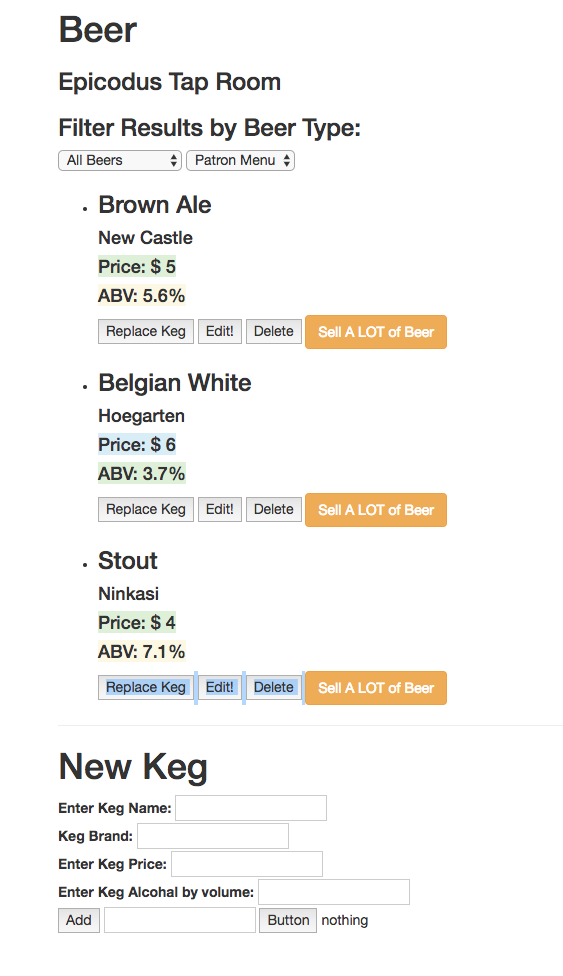

# _Tap Room_

#### _This application allows you to view, edit, delete, and add kegs to a dynamic tap list. Running low? We'll let ya know! Track by ABV, price, etc. ._

#### By _**Aaron Rohrbacher & Nate McGregor**_

## Setup/Installation Requirements

* _Clone this repository_
```
git clone https://github.com/AaronRohrbacher/taproom
```
* _Install Node if you haven't already!_

* _In your bash console, navigate to the root of this project._
```
cd taproom
```
* _Now, run_
```
npm install && bower install && gulp build && gulp serve
```



## What it will do:

The program will allow you to see a keg list based on if you select employee or patron. Patrons can only see kegs with more than 10 pints left in them, while employees can see all kegs, can change kegs and can see how many pints are left in each keg. Users will also be able to filter list by beer name.

_Aaron Rohrbacher: aaronrohrbacher.github.io/portfolio/_

## Technologies Used
_Angular 2, HTML, CSS, JavaScript, jQuery, built and served with Bower and Gulp. Reliant on the betterdoctor.com API and the Google Maps geocoder API._

Copyright (c) 2017 **_Aaron Rohrbacher Nate McGregor_**
